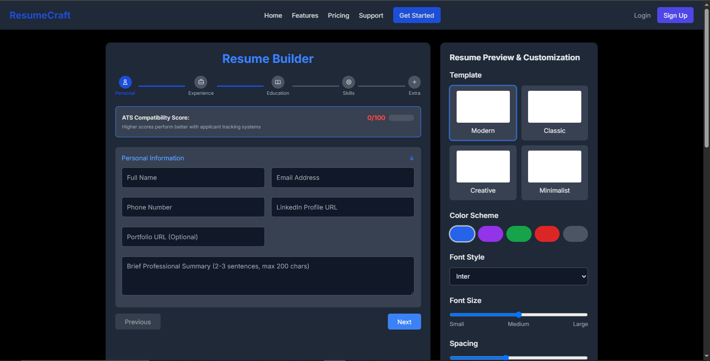
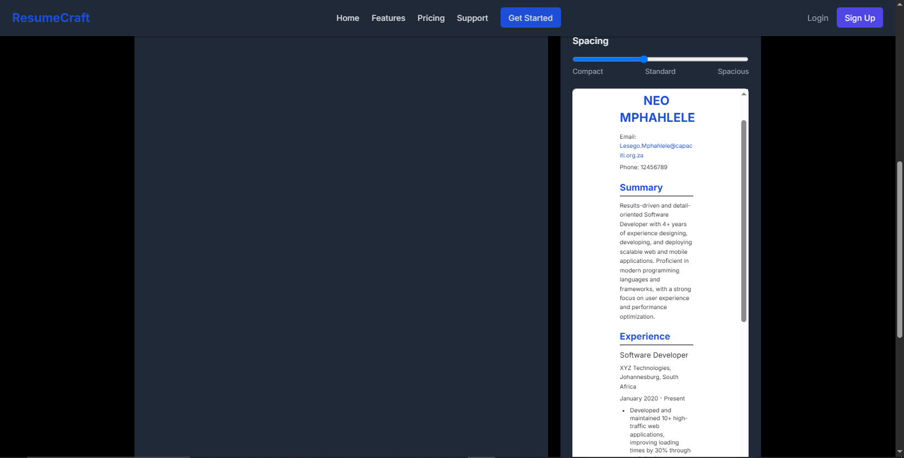
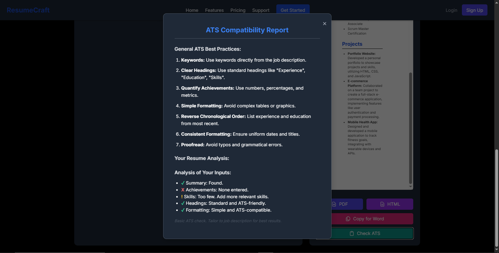

# ResumeCraft - Intelligent Resume Generator

ResumeCraft is an intelligent resume builder that helps you create professional, ATS-friendly resumes with ease. The application provides smart suggestions, real-time previews, and ATS compatibility scoring to ensure your resume stands out.

## Features

- **Smart Resume Builder**: Step-by-step form with intelligent suggestions
- **ATS Optimization**: Real-time compatibility scoring and suggestions
- **Multiple Templates**: Choose from modern, classic, creative, and minimalist designs
- **Customization**: Adjust colors, fonts, spacing, and layout
- **Live Preview**: See changes in real-time as you build your resume
- **Export Options**: Download as PDF, HTML, or copy for Word
- **Job Description Analysis**: Get keyword suggestions from job postings
- **Mobile Responsive**: Works on all device sizes

## Technologies Used

- HTML5, CSS3, JavaScript
- Tailwind CSS for styling
- OpenRouter AI API for content generation
- Drag-and-drop functionality for skills management
- Responsive design principles

## Installation

No installation required! This is a client-side application that runs directly in the browser.

To run locally:
1. Clone this repository
2. Open `index.html` in your preferred browser

## Usage

1. **Fill in your information**:
   - Personal details
   - Work experience (with achievement tracking)
   - Education history
   - Skills (technical and soft)
   - Additional sections (certifications, projects)

2. **Customize your resume**:
   - Choose from multiple templates
   - Adjust color scheme
   - Select font family and size
   - Modify spacing

3. **Preview and export**:
   - View live preview as you type
   - Check ATS compatibility
   - Download as PDF or HTML
   - Copy formatted content for Word

## ATS Optimization Tips

ResumeCraft helps you optimize for Applicant Tracking Systems by:
- Scoring your resume's ATS compatibility
- Suggesting quantifiable achievements
- Recommending keywords from job descriptions
- Ensuring proper formatting and structure

## License

Distributed under the MIT License. See `LICENSE` for more information.

## Contact

Project Link: [ResumeCraft - AI Resume Builder](https://ai-resume-generator-l82k.vercel.app/test_deepseek_code.html)

## Screenshots

